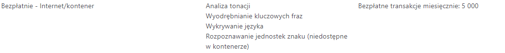

# Azure Content Moderator

1. #### Intro

   - Serwis wykorzystujący uczenie maszynowe oraz dodatkowe API, w celu analizy zawartości tekstu, obrazów, czy nawet filmów pod względem treści niepożądanych.

   - Serwis nie odpowiada za bezpośrednią cenzurę. Pomaga w lokalizacji nieodpowiednich treści. Serwis wyszukuje te określenia, które nauczył się wcześniej jako niewłaściwe. Pozwala nam na otrzymanie informacji na temat treści oraz jej lokalizacji. 

     Wykorzystując ten serwis możemy analizować treści pod różnymi względami:

     - ##### Profanity

       Analiza treści pod względem wyrażeń określonych jako niepożądane (wulgaryzmy). Otrzymujemy informacje na temat określenia oraz jego lokalizacji

     - ##### Classification

       Pozwala na analizę całej treści przez pryzmat kategorii i przyznanie tym kategoriom (1-3) odpowiednich wartości względem treści.

       ~ 1 - Potencjalne występowanie języka związanego z wyrażeniami seksualnymi lub dla dorosłych.

       ~ 2 - Potencjalne występowanie języka związanego z treściami dwuznacznymi lub dojrzałymi.

       ~ 3 - Potencjalne występowanie języka związanego z treściami obraźliwymi.

     - ##### Personally identifiable information (PII)

       Pozwala na identyfikacje osób na podstawie treści.

2. #### Use cases

   * Uniemożliwienie dodania nieodpowiednich zdjęć do danego serwisu (pornografia / drastyczne zdjęcia)
   * Cenzurowanie treści wulgarnych (po otrzymaniu informacji na temat lokalizacji, zastąpienie wyrazów znakami '@#$%*')
   * Prowadząc serwis z grami, uniemożliwienie reklamowania przez Użytkowników produktów konkurencji.
   * Analiza zidentyfikowanych osób może pomóc w porównaniu ich danych z bazami osób poszukiwanych / karanych.

3. #### How to

   * Jak użyć

     - Na portalu Azure tworzymy zasób *Content Moderator*

     - Generujemy potrzebny nam klucz

     - W zależności od naszej lokalizacji korzystamy z API udostępnionego najbliżej nas dla naszego serwisu. W celu umożliwienia komunikacji z API w headerze zamieszczamy `Ocp-Apim-Subscription-Key` wraz z wygenerowanym dla nas kluczem. Więcej w [link](https://westus.dev.cognitive.microsoft.com/docs/services/57cf753a3f9b070c105bd2c1/operations/57cf753a3f9b070868a1f66f )

   * Pricing 

     W przypadku korzystania z interfejsu API obrazy muszą mieć minimalnie 128 pikseli i maksymalny rozmiar pliku wynoszący 4 MB. Maksymalnie dopuszczalna liczba znaków to 1024.

     Dwie rodzaje subskrypcji

     - Free

       ~ jedna transakcja na sekundę

       ~ 5000 transakcji miesięcznie

     - Standard

       ~ 10 transakcji na sekundę

       cennik uzależniony od liczby transakcji:

       


# Language Understanding Intelligent Service (LUIS)

1. #### Intro

   * LUIS to interfejs Azure Cognitive Services API, który stosuje uczenie maszynowe w sposób niestandardowy. Pozwala na zrozumienie sensu analizowanej treści. Pozwala, aby aplikacje mogły wykonywać interakcje z użytkownikiem.

   * LUIS pomaga z treścią zrobić to, co wielu ludziom czasem się nie udaje - zrozumieć. szczególnie w przypadku osób poznających nowy język. Pomaga uniknąć błędnego zrozumienia. 

     LUIS wykorzystuje trzy kluczowe aspekty zrozumienia języka:

     - ##### wypowiedzi

       dane wejściowe od użytkownika (wiadomość), na których pracuje aplikacja (interpretacja wiadomości)

     - ##### intencje

       Zamiar / działanie użytkownika, który jest reprezentowany przez zdania

     - ##### encje

       wyodrębniona jednostka, która reprezentuje słowo / frazę

     Celem tego co realizuje LUIS jest taka analiza danych wejściowych (wypowiedzi), aby zrozumieć intencje użytkownika przy pomocy encji. 

2. #### Use cases

   * wszelkiego rodzaje systemy bookingowe, które na podstawie wypowiedzianej frazy (doprowadzonej do postaci tekstowej), są wstanie przygotować propozycje spełniające intencje
   * realizacja zamówień personalizowany - np. wybór samochodu - użytkownik podaję co go interesuje, w przypadku braku propozycji system może dopytać użytkownika

3. ####  How to

   * Jak użyć

     - Na portalu Azure tworzymy zasób *Language Understanding*

     - na stronei eu.luis.ai logujemy się za pomocą konta Microsoft i tworzymy aplikacje

     - dodajemy intencje określając dla niej minimum 5 przykładowych wypowiedzi

     - dodajemy encje i przyporządkowujemy we wprowadzonych wcześniej wypowiedziach

     - Trenujemy model

     - Tworzymy endpoint i publikujemy 

     - odpytujemy endpoint

     - przykładowa odpowiedź

       ```
       {
           "query": "show me pictures of a local beach",
           "prediction": {
               "topIntent": "SearchPics",
               "intents": {
                   "SearchPics": {
                       "score": 0.9659337
                   },
                   "None": {
                       "score": 0.0279549751
                   },
                   "OrderPic": {
                       "score": 0.0150422584
                   },
                   "SharePic": {
                       "score": 0.008302523
                   },
                   "Greeting": {
                       "score": 0.0005119743
                   }
               },
               "entities": {}
           }
       }
       ```

   * Pricing

     Dwie rodzaje subskrypcji

     - Free

       ~ 5 transakcji na sekundę

       ~ dla rozpoznawania tekstu - 10 000 transakcji na miesiąc

       ~ dla *Authoring Transactions* - 1 000 000 transakcji na miesiąc

     - Standard

       ~ 50 transakcji na sekundę

       ~ dla rozpoznawania tekstu - $1,5 za 1 000 transakcji

       ~ dla rozpoznawania mowy - $5,5 za 1 000 transakcji

     W przypadku żądań tekstowych transakcja to wywołanie interfejsu API z maksymalną długością zapytania wynoszącą 500 znaków.

     W przypadku żądań wymawianych transakcja to wypowiedź z maksymalną długością zapytania wynoszącą 15 sekund.


# Text Analytics API

1. #### Intro

   * Serwis ten umożliwia analizę tekstu i otrzymanie na jego temat informacji. Umożliwia wykrycie języka, uczuć, słów kluczowych oraz znanych encji.
   * Serwis umożliwia wykrywanie oraz określanie nastrojów po przez przypisanie wartości z przedziału 0-1. Wartości bliższe 1 wskazują na nastrój / uczucia pozytywne, a wartości bliższe 0 na negatywne. Wypowiedź neutralna otrzymuje wynik w pobliżu 0.5. 

2. #### Use cases

   * analiza komentarzy na temat produktów (sklep internetowy), może pomóc w tym czy dany produkt powinien zostać sprzedawany / zmieniony, czy też nie 
   * personalizowanie proponowanych produktów na podstawie używanych słów kluczowych

3. #### How to

   * Jak użyć

     - Na portalu Azure tworzymy zasób *Text Analytics*

     - Generujemy klucz

     - Wykonujemy zapytania na endpoint 

       ```
       https://[location].dev.cognitive.microsoft.com/docs/services/TextAnalytics.V2.0
       ```

     - w headerze dodajemy wygenerowany klucz

   * Pricing

     - ##### Free

       

       

     - ##### Standard

       

