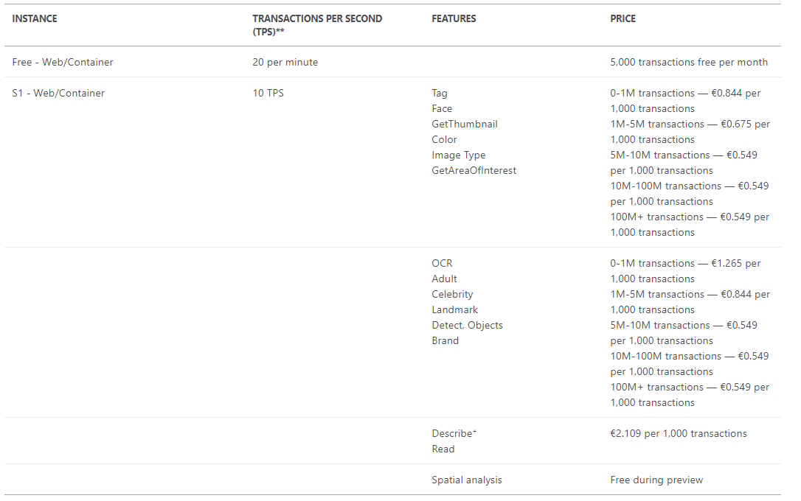

# Computer Vision API

1. #### Intro

   - Face API

     Umożliwia:

     - **weryfikacje** - porównywanie twarzy
     - **wykrywanie** - detekcja ludzki twarzy na obrazie
     - **identyfikacje** - wyszukanie i identyfikacja twarzy 
     - **podobieństwo** - znalezienie podobnych twarzy
     - **grupowanie** - przydział niezidentyfikowanych twarzy do grup na podstawie ich wizualnego podobieństwa

     Za pomocą sztucznej inteligencji możemy:

     - wykrywać aktywności na obrazie
     - dopasowywać twarze do istniejących w bazie danych
     - wykrywać twarze i otrzymywać ich współrzędne 
     - analizować i identyfikować twarze w klatkach video

     Metoda weryfikowania twarzy umożliwia:

     - lokalizacje twarzy - ROI
     - otrzymanie punktów orientacyjnych twarzy - lokalizacja źrenic, nos, ust
     - uzyskanie atrybutów twarzy - szacuje wiek, płeć, kolor włosów, uśmiech, zarost, okulary, emocje

   - ​	Emotion API

     Umożliwia otrzymanie informacji na emocji na obrazie w postaci:

     - **lokalizacji** 
     - **wyników** - lista emocji z prawdopodobieństwem, że twarz przejawia określone emocje

   - analiza obrazów pod kątem wyglądu - usługa opisze co zdaniem jej jest na obrazie

   - OCR - optyczne rozpoznawanie znaków 

     - umożliwia wyodrębnienie tekstu drukowanego jak i pisanego odręcznie

   - analiza wideo

   ​	 

2. #### Use cases

   * użycie OCR dla aplikacji, która ręcznie wypełnione wnioski (np. w przychodni/urzędzie/dziekanacie) przekształcałaby do wersji cyfrowych 
   * Emotion API dla analizy emocji podczas seansu, jak dane fragmenty filmu wpływają na poszczególne osoby na sali i w jakim procencie
   
3. #### How to

   * Jak użyć

     * Utworzenie na [portalu Azure](https://portal.azure.com/#home) zasobu *Computer Vision*
     * w *Resource Management -> Keys and Endpoints* dostępne klucze oraz adres endpointu
       * Face API
         * [python/C#](https://docs.microsoft.com/en-us/learn/modules/identify-faces-with-computer-vision/8-test-face-detection?pivots=csharp)
       * Emotion API
         * [using emotion app](https://docs.microsoft.com/en-us/learn/modules/identify-faces-with-computer-vision/10-using-emotion-api)

   * Pricing 

     

     

