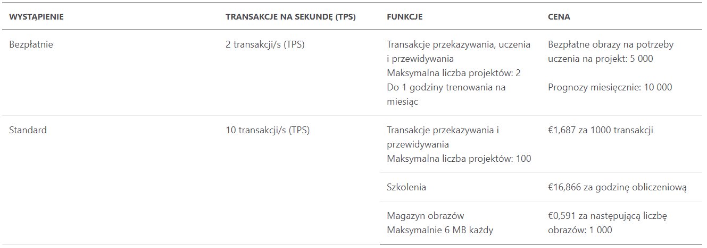

# Custom Vision

1. #### Intro

   - należy do Cognitive Services
   - umożliwia tworzenie modeli klasyfikacji obrazów, na podstawie dostarczonych obrazów
   - po stworzeniu modelu możemy wysyłać do niego obrazy, a ten w odpowiedzi zwróci nam tagi obrazka

2. #### Use cases

   * aplikacja dla początkujących wędkarzy, którzy po zrobieniu zdjęcia wyłowionej ryby, otrzymują informacje o rybie
   * aplikacja dla niedzielnych grzybiarzy, którzy po zrobieniu zdjęcia otrzymają informację, czy grzyb jest jadalny, czy niebezpieczny
   
3. #### How to

   * Jak użyć ([dokładne kroki](https://docs.microsoft.com/en-us/learn/modules/classify-images-with-custom-vision-service/1-create-custom-vision-service-project))

     - zalogować do [Custom Vision Service potal](https://www.customvision.ai/) 

     - dodanie nowego projektu

       - typ projektu: *'classification'* lub *'object detection'*
       - typ klasyfikacji: *'multilable'* lub *'multiclass'*
       - domena: optymalizuje model, pod kątem określonych typów obrazów, w w przypadku braku pasującej domeny, należy wybrać domenę ogólną.

     - dodanie obrazów wraz z tagami

     - trenowanie modelu 

     - testowanie modelu

     - opublikowanie modelu

     - odpytanie endpointu przez HTTP

       ```
       https://{endpoint}/customvision/v3.0/training/projects/{projectId}/images/{imageType}
       ```

       `{endpoint}` - adres endpointu stworzonego serwisu

       `{projectId}` - unikalny identyfikator projektu Custom Vision

       `{imageType}` - adres URL do obrazu lub plik obrazu

     - treść zapytania:

       ```json
       {
         "images": [
           {
             "url": "{url to image #1}",
             "tagIds": [ "{tag-id}" ]
           }
         ],
         "tagIds": [
            "{tag-id}"
         ]
       }
       ```

     - przykładowa odpowiedź:

       ```json
       [
          {
             "id":"56fe8dca-2849-454a-8aa0-5897b1c30009",
             "name":"Arctic fox",
             "description":null,
             "type":"Regular",
             "imageCount":130
          },
          {
             "id":"ae6f7ccb-46ac-44af-9b70-8d91f4951122",
             "name":"Walrus",
             "description":null,
             "type":"Regular",
             "imageCount":138
          },
          {
             "id":"8b2ada4d-1d0f-4b07-af19-dfd643043e1f",
             "name":"Polar bear",
             "description":null,
             "type":"Regular",
             "imageCount":141
          }
       ]
       ```

       

   * Pricing 

     

